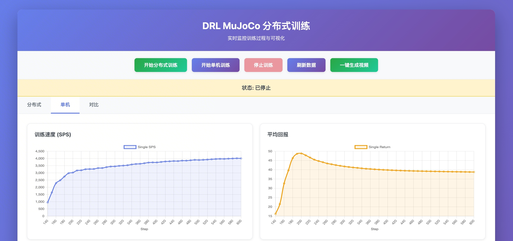
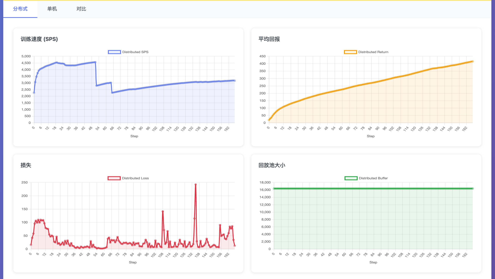
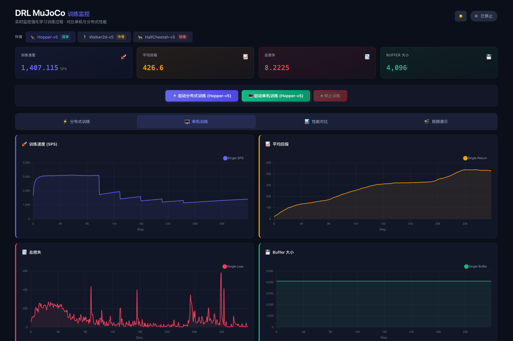
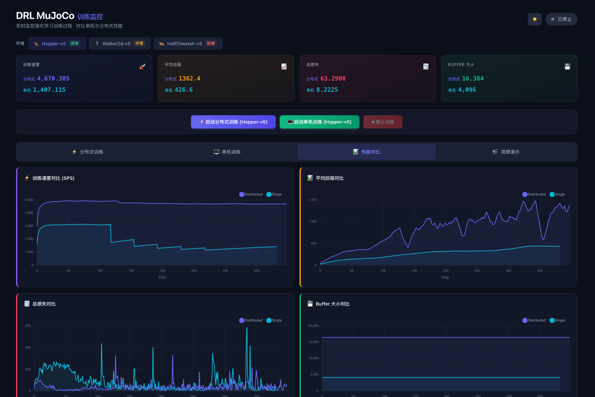

<div align="center">

# 🤖 DRL MuJoCo

**分布式深度强化学习训练框架**

基于 Ray 的 Actor-Learner 架构，面向 MuJoCo 环境进行并行采样与策略优化

[](https://nextjs.org/)
[](https://react.dev/)
[](https://tailwindcss.com/)
[](https://python.org/)
[](https://pytorch.org/)
[](https://ray.io/)
[](https://rust-lang.org/)
[](https://fastapi.tiangolo.com/)

</div>

---

## ✨ 核心特性

<table>
<tr>
<td width="50%">

### 🚀 分布式训练
- **Actor-Learner 架构**：Ray 驱动的并行采样
- **Parameter Server**：异步参数同步
- **PPO 算法**：裁剪机制 + 自适应熵系数
- **GAE**：广义优势估计
- **自动设备选择**：CUDA → MPS → CPU

</td>
<td width="50%">

### 📊 实时可视化
- **Next.js 15** + **React 19** + **Tailwind CSS 3**
- **4 核心指标**：SPS、平均回报、损失、Buffer 大小
- **WebSocket 实时推送**：自动重连机制
- **性能对比**：分布式 vs 单机训练
- **一键生成视频**：智能体表现演示

</td>
</tr>
<tr>
<td width="50%">

### ⚡ Rust 高性能缓冲区
- **SoA 内存布局**：连续内存，缓存友好
- **Rayon 并行 GAE**：多线程优势函数计算
- **PyO3 绑定**：无缝集成 Python
- **目标 10-50x** 内存操作加速

</td>
<td width="50%">

### 🧠 PPO 优化
- 全局 Advantage 标准化
- 学习率线性衰减
- 梯度裁剪 + KL 散度早停
- 价值函数解释方差监控
- Clip Fraction 实时追踪

</td>
</tr>
</table>

---

## 🖼️ 界面预览

<table>
<tr>
<td align="center"><b>🖥️ Web UI 总界面</b></td>
<td align="center"><b>📊 分布式训练监控</b></td>
</tr>
<tr>
<td></td>
<td></td>
</tr>
<tr>
<td align="center"><b>📈 单机训练监控</b></td>
<td align="center"><b>⚖️ 性能对比视图</b></td>
</tr>
<tr>
<td></td>
<td></td>
</tr>
</table>

<div align="center">

<p><b>🎬 视频演示：一键生成分布式 & 单机训练结果对比视频</b></p>
</div>

---

## 🏗️ 项目结构

```
DRL_MuJoCo/
├── main.py                    # 训练入口
├── drl/                       # 核心 DRL 模块
│   ├── config.py              # 配置 dataclass
│   ├── config_loader.py       # YAML 配置加载
│   ├── models.py              # Actor-Critic 模型
│   ├── ray_components.py      # Ray 分布式组件
│   ├── logging_utils.py       # 日志工具
│   └── video_generator.py     # 视频生成
├── config/                    # 配置文件
│   ├── config.yaml            # 分布式训练 (8 Actors)
│   └── config_single.yaml     # 单机训练 (1 Actor)
├── web/                       # Web UI
│   ├── server.py              # FastAPI 后端
│   ├── next.config.ts         # Next.js 配置
│   ├── tailwind.config.ts     # Tailwind 主题配置
│   └── src/
│       ├── app/               # Next.js App Router
│       ├── components/        # React 组件
│       ├── hooks/             # 自定义 Hooks
│       ├── services/          # API & WebSocket
│       ├── stores/            # Zustand 状态
│       └── types/             # TypeScript 类型
├── rust_buffer/               # Rust 高性能缓冲区
│   ├── src/
│   │   ├── buffer.rs          # SoA 回放缓冲区
│   │   ├── gae.rs             # 并行 GAE 计算
│   │   └── lib.rs             # PyO3 绑定
│   ├── Cargo.toml
│   └── pyproject.toml
└── scripts/                   # 辅助脚本
    ├── build.sh               # 环境搭建
    ├── start.sh               # 交互式启动器
    ├── plot_training.py       # 训练曲线
    └── plot_comparison.py     # 对比曲线
```

---

## 🚀 快速开始

### 1️⃣ 环境搭建

```bash
bash scripts/build.sh
```

该脚本将自动：
- ✅ 检查 & 创建 conda 环境 (`drl-arm`)
- ✅ 安装 Python 依赖 (PyTorch, Ray, MuJoCo...)
- ✅ 可选构建 Next.js 前端
- ✅ 可选构建 Rust 回放缓冲区

### 2️⃣ 启动训练

```bash
bash scripts/start.sh
```

| 选项 | 描述 |
|:----:|------|
| `1` | 分布式训练 (8 Actors) |
| `2` | 单机训练 (1 Actor) |
| `3` | 绘制训练曲线 |
| `4` | 绘制对比曲线 |
| `5` | 启动 Web UI (生产模式) |
| `6` | 🌟 启动 Next.js Dev Server + Web UI (推荐) |

### 3️⃣ 访问 Web UI

选择选项 `6` 后，打开浏览器访问 **http://localhost:3000**

---

## ⚙️ 配置说明

编辑 [`config/config.yaml`](config/config.yaml) 调整训练超参：

| 参数 | 默认值 | 说明 |
|------|--------|------|
| `env_name` | `Hopper-v5` | MuJoCo 环境名称 |
| `num_actors` | `8` | 并行采样器数量 |
| `rollout_length` | `2048` | 单次采样轨迹长度 |
| `batch_size` | `64` | 训练批次大小 |
| `lr` | `0.0003` | 学习率 |
| `gamma` | `0.99` | 折扣因子 |
| `gae_lambda` | `0.95` | GAE λ 参数 |
| `clip_ratio` | `0.2` | PPO 裁剪比率 |
| `hidden_sizes` | `[64, 64]` | 隐藏层大小 |
| `max_iters` | `3000` | 最大训练迭代数 |
| `lr_schedule` | `linear` | 学习率调度策略 |
| `target_kl` | `0.02` | KL 散度早停阈值 |

---

## 📊 单机 vs 分布式对比实验

```bash
# 1. 运行单机训练
bash scripts/start.sh  # 选择 2

# 2. 运行分布式训练
bash scripts/start.sh  # 选择 1

# 3. 绘制对比曲线
bash scripts/start.sh  # 选择 4
```

生成 `output/comparison_curves.png`，对比 **训练速度 (SPS)** 和 **平均回报**。

---

## 🌐 Web UI 详细说明

### 开发模式

```bash
bash scripts/start.sh  # 选择 6
```

自动启动：
1. **FastAPI 后端** → http://127.0.0.1:8000
2. **Next.js 开发服务器** → http://localhost:3000
3. API 请求自动代理到 FastAPI

### 生产模式

```bash
cd web && npm install && npm run build && cd ..
bash scripts/start.sh  # 选择 5
# 访问 http://127.0.0.1:8000
```

### 功能列表

| 功能 | 描述 |
|------|------|
| 🎮 训练控制 | 一键启动/停止分布式 & 单机训练 |
| 📡 实时监控 | WebSocket 推送 SPS、回报、损失、Buffer 大小 |
| 📈 在线绘图 | Chart.js 实时训练曲线 |
| ⚖️ 性能对比 | 分布式 vs 单机同屏对比 |
| 🎬 视频生成 | 一键生成智能体表现视频，支持重生成 |

---

## 🦀 Rust 回放缓冲区

<details>
<summary>📖 点击展开详情</summary>

### 特性

- **Structure of Arrays (SoA)** 内存布局 — 连续内存，缓存局部性更优
- **Rayon 并行 GAE** — 多线程并行计算优势函数
- **PyO3 Python 绑定** — 无缝集成到现有 Python 训练代码
- **目标 10-50x** 内存操作速度提升

### 构建

```bash
# 方式一：通过构建脚本
bash scripts/build.sh  # 选择构建 Rust Buffer

# 方式二：手动构建
cd rust_buffer
pip install maturin
maturin develop --release
```

> ⚠️ 需要先安装 Rust：`curl --proto '=https' --tlsv1.2 -sSf https://sh.rustup.rs | sh`

</details>

---

## 🛠️ 技术栈

<table>
<tr>
<th>后端</th>
<th>前端</th>
<th>性能优化</th>
</tr>
<tr>
<td>


</td>
<td>


</td>
<td>


</td>
</tr>
</table>

---

## 🏛️ 架构概览

```
┌─────────────────────────────────────────────────────────┐
│                     Next.js Frontend                     │
│  ┌──────────┐ ┌──────────┐ ┌──────────┐ ┌───────────┐  │
│  │Distributed│ │  Single  │ │Comparison│ │   Video   │  │
│  │   Tab     │ │   Tab    │ │   Tab    │ │  Section  │  │
│  └─────┬─────┘ └─────┬────┘ └─────┬────┘ └─────┬─────┘  │
│        └──────────────┼───────────┼─────────────┘        │
│                  ┌─────┴─────┐                            │
│                  │  Zustand  │                            │
│                  │   Store   │                            │
│                  └─────┬─────┘                            │
│            ┌───────────┼───────────┐                      │
│       ┌────┴────┐     │     ┌─────┴────┐                │
│       │REST API │     │     │WebSocket │                │
│       └────┬────┘     │     └─────┬────┘                │
└────────────┼──────────┼───────────┼──────────────────────┘
             │          │           │
┌────────────┼──────────┼───────────┼──────────────────────┐
│        ┌───┴──────────┴───────────┴───┐                  │
│        │       FastAPI Backend        │                  │
│        └───────────────┬──────────────┘                  │
│                   ┌────┴────┐                             │
│                   │  Ray    │                             │
│                   │ Cluster │                             │
│        ┌──────────┼────────┼──────────┐                  │
│   ┌────┴────┐ ┌───┴───┐ ┌───┴───┐ ┌──┴──┐              │
│   │ Actor 0 │ │Actor 1│ │Actor N│ │Learner│             │
│   └────┬────┘ └───┬───┘ └───┬───┘ └──┬──┘              │
│        └──────────┼──────────┼────────┘                  │
│              ┌────┴────┐                                  │
│              │  Param  │                                  │
│              │ Server  │                                  │
│              └─────────┘                                  │
│                     Backend (Python)                      │
└──────────────────────────────────────────────────────────┘
```
